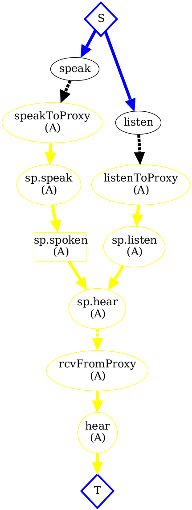
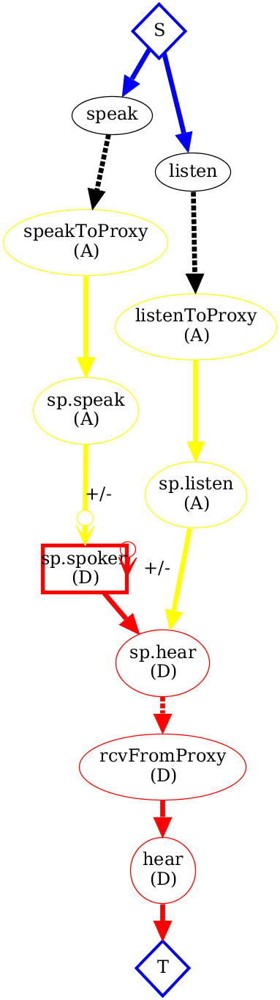

[Slides](slides.pptx)

Communication: a speaker and a listener

        module Rendezvous
          state do
            interface input, :speak, [:subject, :val]
            interface input, :listen, [:ident, :subject]
            interface output, :hear, [:hear_id, :subject, :val]
          end
          bloom do
            stdio <~ hear.inspected
          end
        end

Rendezvous as join:

        module SynchronousRendezvous
          include Rendezvous
          bloom do
            hear <= (speak*listen).pairs(:subject=>:subject) {|s,l| [l.ident, s.subject, s.val]}
          end
        end

Speaker persists (AKA shared memory):

        module SpeakerPersist
          include Rendezvous
          state do
            table :spoken, [:subject, :val]
          end
          bloom :persist do
            spoken <= speak
          end
          bloom do
            hear <= (spoken*listen).pairs(:subject=>:subject) {|s,l| [l.ident, s.subject, s.val]}
          end
        end

Listener persists (AKA message passing):

        module ListenerPersist
          include Rendezvous
          state do
            table :listening, [:ident, :subject]
          end
          bloom do
            listening <= listen
            hear <= (speak*listening).pairs(:subject=>:subject) {|s,l| [l.ident, s.subject, s.val]}
          end
        end

Overwriting KVS:

        module MutableSpeakerPersist
          include Rendezvous
          state do
            table :spoken, [:subject, :val]
          end
          bloom :persist do
            spoken <+ speak
            spoken <- (speak * spoken).rights(:subject => :subject)
          end
          bloom do
            hear <= (spoken*listen).pairs(:subject=>:subject) {|s,l| [l.ident, s.subject, s.val]}
          end
        end

Plot of distributed SpeakerPersist (AKA append-only, unordered key/value store)

Plot of distributed MutableSpeakerPersist (AKA KVS)

